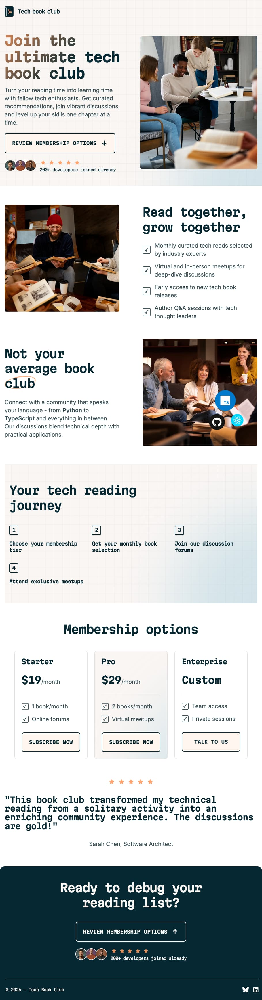

# Frontend Mentor - Tech book club landing page solution

This is a solution to the [Tech book club landing page challenge on Frontend Mentor](https://www.frontendmentor.io/challenges/tech-book-club-landing-page-fZQidjHU73). Frontend Mentor challenges help you improve your coding skills by building realistic projects.

## Table of contents

- [Overview](#overview)
  - [The challenge](#the-challenge)
  - [Screenshot](#screenshot)
  - [Links](#links)
- [My process](#my-process)
  - [Built with](#built-with)
  - [What I learned](#what-i-learned)
  - [Continued development](#continued-development)
- [Author](#author)

## Overview

### The challenge

Users should be able to:

- View the optimal layout for the interface depending on their device's screen size
- See hover and focus states for all interactive elements on the page

### Screenshot

### Links

- Solution URL: [Github](https://github.com/katrien-s/fe-26-002-tech-book-club-landing-page)
- Live Site URL: [Netlify](https://fe-26-002-tech-book-club-landing-page.netlify.app/)

## My process

### Built with

- Semantic HTML5 markup
- CSS custom properties
- Flexbox
- CSS Grid
- Mobile-first workflow

### What I learned

I was thinking of using CSS Nesting as first when I started. Since this is not yet widely supported, I thought of implementing Sass. I set it up, started writing it but I couldn't see why I would write is as such, since the Sass processor would still turn it into plain CSS. I'm not in favor of overcomplicating things, so I went back to writing the regular CSS myself.

### Continued development

I know I need to get more used to writing nested CSS and even using the newer container & layer-options. But in this exercise I wanted to write decent CSS I'm confident writing.

## Author

- Frontend Mentor - [@katrien-s](https://www.frontendmentor.io/profile/katrien-s)
